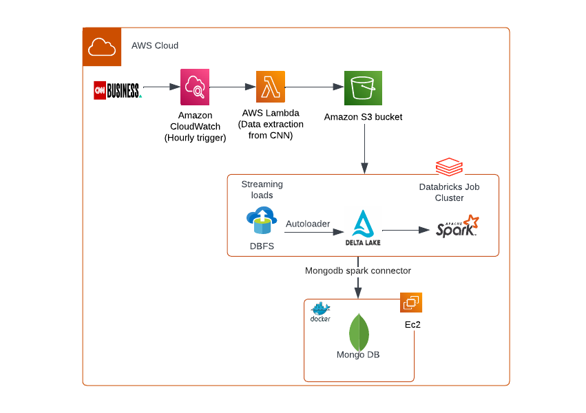
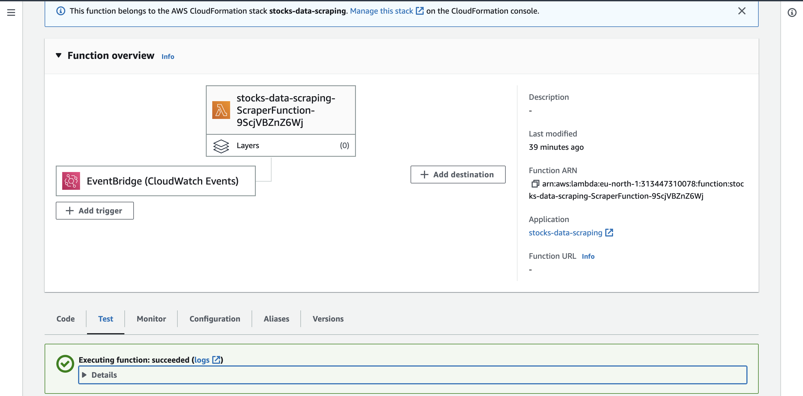
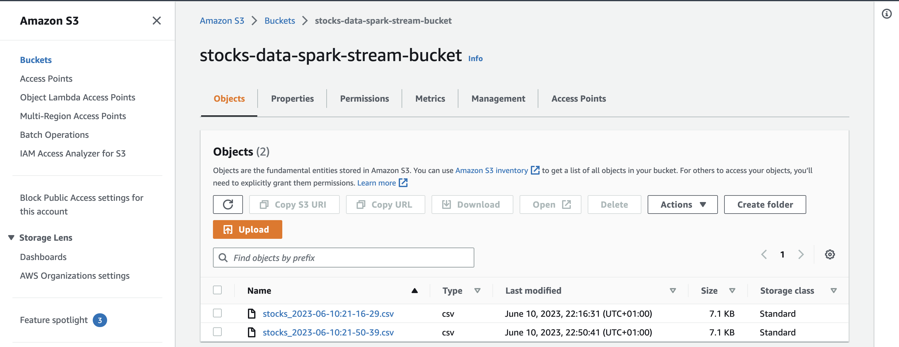
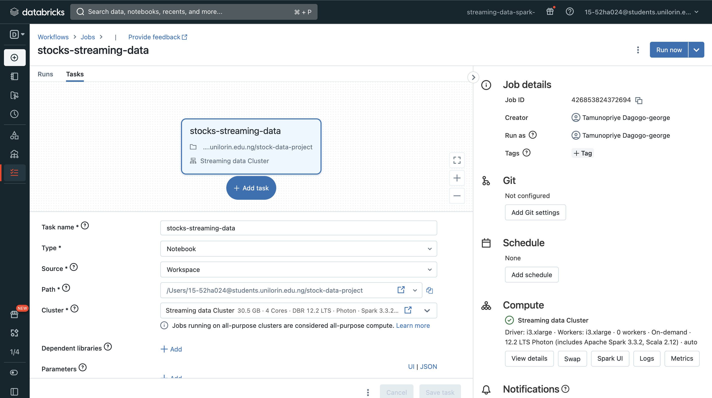
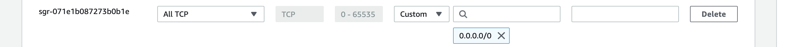
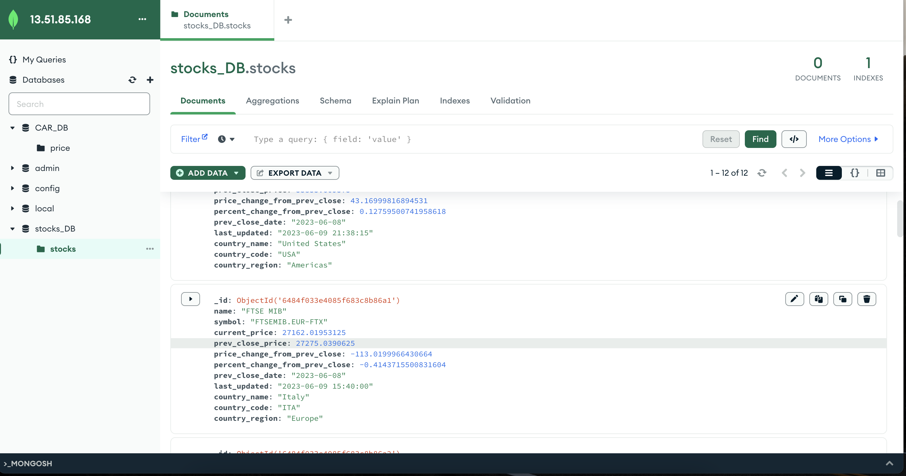

# Streaming Data with Apache Spark on Databricks 
This repository provides examples and code snippets for streaming data processing using Apache Spark on Databricks with AWS services. It demonstrates how to leverage the power of Spark streaming to process and analyze real-time data in a distributed and scalable manner, utilizing various AWS services for data ingestion and storage. 

### Technologies used
- <b>Databricks</b> : Databricks is a unified set of tools for building, deploying, sharing, and maintaining enterprise-grade data solutions at scale. For this project it was used to access its Delta lake, Apache spark, and Structured streaming technology.  
- <b>AWS EC2</b> : This is a cloud-based computing service that allows users to quickly launch virtual servers and manage cookies, security, and networking from an easy-to-use dashboard. It was used to host containerized Mongo Database for this project.  
- <b>AWS S3</b>: This is a highly scalable object storage service that stores data as objects within buckets. It is commonly used to store and distribute large media files, data backups and static website files. For this project it is used to store data scraped from target website.   
- <b>AWS Lambda</b>: This is a serverless compute service that lets you run codes without  provisioning or managing any server. lambda functions can be used to run code in response to events like changes in S3, DynamoDB, cron jobs, etc. For this project, it was used to run the data scrape function triggered every hour.   
- <b>AWS Cloudwatch</b>: This is a monitoring and management service that provides data and actionable insights for AWS, hybrid, and on-premises applications and resources. For this project it was used to collect and aggregate metrics and logs from the Lambda functions. The performance events are ingested as CloudWatch logs to simplify monitoring and troubleshooting.   
- <b>AWS Severless Application Model (SAM)</b>: This is a service that is designed to make the creation, deployment, and execution of serverless applications as simple as possible. This can be done using AWS SAM templates. For this project it was used to deploy our lambda function.   
- <b>Mongo DB</b>: MongoDB is a source-available cross-platform document-oriented database program. Classified as a NoSQL database program, MongoDB uses JSON-like documents with optional schemas.  

## Architecture

 

### Languages used
- Python
- yaml(for AWS SAM templates)  

### Datasets
Data was scraped from - https://edition.cnn.com/markets using Python requests module.
The website does not provide a public API, hence it was reverse engineered to get endpoints. Postman was then used to analyze endpoint

### Development Process
1. Installed AWS SAM and created Lambda function using SAM Template. Sample template used can be found <a href="https://github.com/priye-1/Streaming_Data_ETL_with_Apache_Spark_on_Databricks/blob/master/stocks_data_scraping/sample_template.yaml">here</a> 
  
    
2. Created S3 Bucket and IAM role to enable access to s3 from AWS Lambda, also created new user to access AWS key and secret key  
  

3. Created Databricks account from AWS market place and set up spark streaming jobs on notebook. This job will continously load data from S3 onto Databricks File System (DBFS) and then autoloader loads the data from DBFS into Delta lakes for spark processing. Notebook can be found <a href="https://github.com/priye-1/Streaming_Data_ETL_with_Apache_Spark_on_Databricks/blob/master/spark_stream_job.ipynb">here</a>.  
  

4. Created EC2 Instance (Linux2 AMI) with at least 2gb RAM to host MongoDB and allowed access to mongo port  
  

5. Set up containerized mongodb on server to receive spark streams. The streams are loaded directly into Mongodb and can be visualized using Mongodb Compass. Set up commands can be found <a href="https://github.com/priye-1/Streaming_Data_ETL_with_Apache_Spark_on_Databricks/blob/master/commands.sh">here</a>.
  

#### Pipeline Flow
Triggers Lambda function -> scrapes data from API -> loads data into s3 -> Mounts data from S3 into DBFS and then into Delta lake ->  Reads Stream from Delta lake and processes stream -> Loads stream into Mongo DB  

#### Necessary Files
1. Linux commands for Mongodb and container setup can be found <a href="https://github.com/priye-1/Streaming_Data_ETL_with_Apache_Spark_on_Databricks/blob/master/commands.sh">here</a>
2. Notebook can be found  <a href="https://github.com/priye-1/Streaming_Data_ETL_with_Apache_Spark_on_Databricks/blob/master/spark_stream_job.ipynb">here</a> This should run in your environment if set up correctly
3. Lambda application to scrape data can be found here <a href="https://github.com/priye-1/Streaming_Data_ETL_with_Apache_Spark_on_Databricks/tree/master/stocks_data_scraping">here</a>
4. SQL commands to set up database can be found <a href="https://github.com/priye-1/Streaming_Data_ETL_with_Apache_Spark_on_Databricks/blob/master/commands.sql">here</a>

### References
<li><a href="https://docs.databricks.com/ingestion/auto-loader/index.html">Databricks Autoloader</a></li>
<li><a href="https://docs.aws.amazon.com/serverless-application-model/latest/developerguide/sam-resource-function.html">SAM resource function </a></li>
<li><a href="https://ngdeveloper.com/how-to-run-mongodb-in-your-aws-ec2-docker-container/">Installing Mongodb in EC2 Container </a></li>
<li><a href="https://www.delftstack.com/howto/mongodb/mongodb-default-username-and-password/">MongoDB Authentication</a></li>
<li><a href="https://www.mongodb.com/docs/spark-connector/current/">Mongodb Connector for Spark</a></li>
<li><a href="https://sparkbyexamples.com/pyspark-tutorial/">Pyspark Tutorial</a></li>
